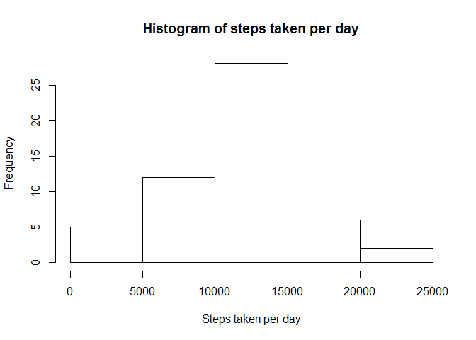
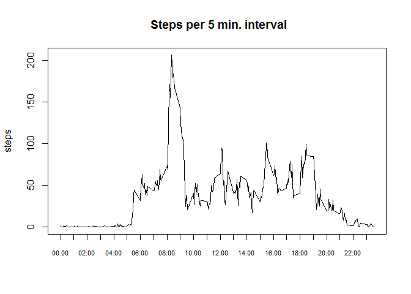
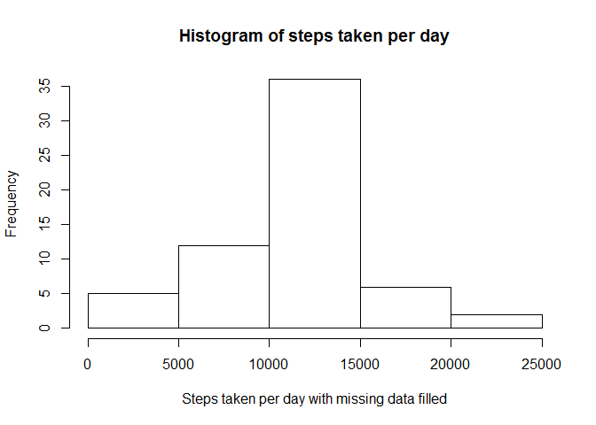
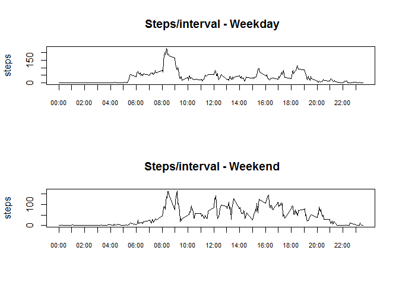

# Reproducible Research: Peer Assessment 1


## Loading and pre-processing the data

```r
##Part 1
#check existence of source data file in working directory
lf<-dir()
if (("activity.csv" %in% lf) == FALSE ) {
        stop("Source file unavailable!") 
}
#Load/Preprocess source data
df.src<- read.csv("activity.csv")
df.src$date = as.Date(df.src$date)
#Dataframe with NA values removed
df.1<-df.src[complete.cases(df.src),]
```
## What is mean total number of steps taken per day?

```r
#for 'steps taken per day', plot a histogram; 
df.1_sum<-aggregate(steps~date, data = df.1,sum)
hist(df.1_sum$steps,xlab="Steps taken per day",
     main="Histogram of steps taken per day")
```

 

```r
# Report mean and median values of steps taken per day
mean_by_day = as.character(mean(df.1_sum$steps))
median_by_day = as.character(median(df.1_sum$steps))
```
* Mean value of 'Total steps per day' is 10766.1886792453.  
* Median value of 'Total steps per day' is 10765.

## What is the average daily activity pattern?

```r
#average steps per interval, displayed as time series plot
df.1_ave<- aggregate(steps~interval,data=df.1,mean)
#interval with max average steps
df.1_ave$interval=formatC(df.1_ave$interval,width=4,format="d",flag="0")
max_interval = df.1_ave[df.1_ave$steps==max(df.1_ave$steps),1]
max_interval = as.character(strptime(max_interval,"%H%M"),"%H:%M")

plot(steps~interval,data=df.1_ave,type="l",xaxt="n", 
     main =" Steps per 5 min. interval", xlab="")

at = df.1_ave$interval[seq(1,length(df.1_ave$interval),12)]
axis(1, at=at, format(as.character(strptime(at,"%H%M"),"%H:%M")),cex.axis = .7)
```

 
  
* Interval with max 'Average steps per day' = 08:35.

## Imputing missing values
+ Missing values are replaced with average value of steps for same time-interval.
+ Values are rounded using as.integer() function.
+ Data frame df.2 below is a copy of source data with missining values filled.

```r
no_of_na_rows = nrow(df.src) - nrow(df.1)
df.2 = df.src
#replace NA values in df.2 with average for same interval
for ( i in 1:nrow(df.2)){   #couldn't get apply functions to work so loop
        if(is.na(df.2$steps[i])){
                df.2$steps[i]= 
                        as.integer(mean(df.1$steps[df.1$interval==df.2$interval[i]]))
        }
}
df.2_sum<-aggregate(steps~date, data = df.2,sum)
# Report mean and median values of steps taken per day in new dataset
mean2_by_day = as.character(mean(df.2_sum$steps))
median2_by_day = as.character(median(df.2_sum$steps))

#Histogram for steps taken per day with supplanted data
hist(df.2_sum$steps,xlab="Steps taken per day with missing data filled",
     main="Histogram of steps taken per day")
```

 
  
* Total no of missing values = 2304.
* Mean value of steps per day (with missing data filled) = 10749.7704918033.
* Median value of steps per day (with missing data filled) = 10641.
* Mean and median values with missing data as.is = 10766.1886792453, 10765.


## Are there differences in activity patterns between weekdays and weekends?

```r
#Analyse data by weekday/weekend split
df.2$wd = weekdays(df.2$date)
df.2$wd = sub("Monday|Tuesday|Wednesday|Thursday|Friday","weekday",df.2$wd)
df.2$wd = sub("Saturday|Sunday","weekend",df.2$wd)

#Plot for weekday avg steps/interval        
par(mfrow=c(2,1))
df.2_ave<-aggregate(steps~(interval+wd),data=df.2,mean)
plot(steps~interval,data=subset(df.2_ave,wd=="weekday"),type="l",xaxt="n", 
     main =" Steps/interval - Weekday", xlab="")
df.2_ave$interval=formatC(df.1_ave$interval,width=4,format="d",flag="0")
at = df.2_ave$interval[seq(1,length(df.2_ave$interval),12)]
axis(1, at=at, format(as.character(strptime(at,"%H%M"),"%H:%M")),cex.axis = .7)

#Plot for weekend avg steps/interval
plot(steps~interval,data=subset(df.2_ave,wd=="weekend"),type="l",xaxt="n", 
     main =" Steps/interval - Weekend", xlab="")
df.2_ave$interval=formatC(df.1_ave$interval,width=4,format="d",flag="0")
at = df.2_ave$interval[seq(1,length(df.2_ave$interval),12)]
axis(1, at=at, format(as.character(strptime(at,"%H%M"),"%H:%M")),cex.axis = .7)
```

 
  
+End of document.
